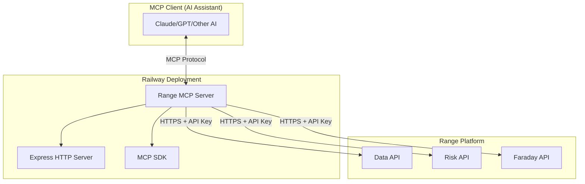

# Design Document: Range MCP Server

## Overview

The Range MCP Server is a Model Context Protocol server that exposes Range's blockchain intelligence APIs to AI assistants and other MCP clients. Built with TypeScript and Node.js, it provides a standardized interface for accessing Range's Data API and Risk API capabilities, enabling AI assistants to perform blockchain analytics, risk assessment, and compliance operations.

The server implements the MCP specification using the official `@modelcontextprotocol/sdk` and is designed for deployment on Railway cloud platform with environment-based configuration.

## Architecture

### High-Level Architecture



### Component Architecture

The server follows a modular architecture with clear separation of concerns:

- **MCP Layer**: Handles MCP protocol communication and tool registration
- **API Layer**: Manages Range API interactions and authentication
- **Service Layer**: Implements business logic for blockchain intelligence operations
- **Transport Layer**: HTTP server for MCP communication

## Components and Interfaces

### Core Components

#### 1. MCP Server (`McpServer`)
- **Purpose**: Main MCP protocol handler
- **Responsibilities**: 
  - Tool registration and discovery
  - Request routing and response handling
  - Error handling and logging
- **Interface**: Implements MCP specification for tool exposure

#### 2. Range API Client (`RangeApiClient`)
- **Purpose**: Centralized Range API communication
- **Responsibilities**:
  - API authentication with bearer token
  - HTTP request/response handling
  - Rate limiting and retry logic
  - Error standardization
- **Interface**:
```typescript
interface RangeApiClient {
  get<T>(endpoint: string, params?: Record<string, any>): Promise<T>
  post<T>(endpoint: string, data?: any): Promise<T>
  put<T>(endpoint: string, data?: any): Promise<T>
  delete<T>(endpoint: string): Promise<T>
}
```

#### 3. Tool Handlers
Individual handlers for each MCP tool, organized by domain:

**Address Intelligence Tools**:
- `getAddressInfo`: Address information and labels
- `getAddressBalance`: Current token balances
- `getAddressTransactions`: Transaction history
- `getAddressCounterparties`: Interaction analysis
- `getAddressRiskScore`: Risk assessment

**Transaction Analysis Tools**:
- `getTransactionDetails`: Transaction information
- `getTransactionRisk`: Risk scoring
- `simulateTransaction`: Pre-execution analysis
- `trackTransactionStatus`: Status monitoring

**Network Intelligence Tools**:
- `getNetworkStats`: Network-wide analytics
- `getWhaleMovements`: Large transaction tracking
- `getCrossChainTransfers`: Cross-chain monitoring
- `getProtocolStats`: Protocol analytics

**Compliance Tools**:
- `createPerson`: IVMS101 entity creation
- `getPerson`: Entity retrieval
- `checkSanctions`: OFAC/blacklist screening
- `getPaymentRisk`: Payment risk assessment

#### 4. Configuration Manager (`ConfigManager`)
- **Purpose**: Environment and configuration management with security validation
- **Responsibilities**:
  - Environment variable validation with security checks
  - API endpoint configuration
  - Railway-specific settings
  - API key format validation and security enforcement
- **Interface**:
```typescript
interface Config {
  rangeApiKey: string // Must be provided by user, never hardcoded
  rangeBaseUrl: string
  port: number
  logLevel: string
}

interface ConfigManager {
  validateApiKey(key: string): boolean
  loadConfig(): Config
  validateEnvironment(): void
}
```

### Data Models

#### MCP Tool Schema
```typescript
interface McpTool {
  name: string
  description: string
  inputSchema: {
    type: "object"
    properties: Record<string, any>
    required?: string[]
  }
}
```

#### Range API Response Wrapper
```typescript
interface RangeApiResponse<T> {
  data: T
  success: boolean
  error?: string
  rateLimit?: {
    remaining: number
    resetTime: number
  }
}
```

#### Address Information Model
```typescript
interface AddressInfo {
  address: string
  network: string
  labels: string[]
  firstSeen?: string
  lastSeen?: string
  totalTransactions?: number
}
```

#### Risk Assessment Model
```typescript
interface RiskAssessment {
  address: string
  riskScore: number
  riskLevel: 'low' | 'medium' | 'high' | 'critical'
  factors: string[]
  sanctions: boolean
  blacklisted: boolean
}
```

## Correctness Properties

*A property is a characteristic or behavior that should hold true across all valid executions of a system—essentially, a formal statement about what the system should do. Properties serve as the bridge between human-readable specifications and machine-verifiable correctness guarantees.*

Let me analyze the acceptance criteria to determine which are testable as properties:

Based on the prework analysis, I'll consolidate redundant properties and focus on the most valuable correctness guarantees:

### Property 1: MCP Protocol Compliance
*For any* valid MCP protocol request, the server should respond with properly formatted MCP protocol messages that conform to the specification
**Validates: Requirements 1.1**

### Property 2: API Authentication Consistency
*For any* Range API request, the server should include the correct authorization header with the configured API key
**Validates: Requirements 1.3, 5.5**

### Property 3: Multi-Network Support
*For any* supported blockchain network identifier, the server should accept and process requests for that network across all applicable endpoints
**Validates: Requirements 2.4, 3.4, 4.4**

### Property 4: Structured API Response Format
*For any* successful API operation (address info, transaction analysis, network data, compliance operations), the server should return data in the expected structure with all required fields
**Validates: Requirements 2.1, 2.2, 3.1, 4.1, 4.3, 5.1**

### Property 5: Comprehensive Error Handling
*For any* API error condition (invalid input, network failure, rate limits), the server should return structured error responses with appropriate error codes and messages
**Validates: Requirements 2.5, 3.5, 7.1, 7.3**

### Property 6: Configuration Validation and Security
*For any* server startup, all required environment variables should be validated, API keys should never be hardcoded, and invalid configuration should cause startup failure with clear error messages
**Validates: Requirements 6.1, 6.2, 6.3, 6.4, 6.5, 6.6, 8.1, 8.2, 8.4, 8.5**

### Property 7: Retry Logic Consistency
*For any* rate limit or transient error response from Range APIs, the server should implement exponential backoff retry logic
**Validates: Requirements 4.5, 7.2**

### Property 8: Audit Logging Completeness
*For any* API operation or error condition, the server should generate appropriate log entries with sufficient detail for debugging and compliance
**Validates: Requirements 1.5, 5.4, 7.4**

### Property 9: Service Isolation
*For any* error in one API operation, other concurrent operations should continue to function normally
**Validates: Requirements 7.5**

### Property 10: Connection Lifecycle Management
*For any* MCP connection establishment or termination, the server should properly manage connection state and cleanup resources
**Validates: Requirements 1.4**

## Error Handling

### Error Classification

The server implements a hierarchical error handling system:

1. **MCP Protocol Errors**: Invalid MCP requests, malformed messages
2. **Authentication Errors**: Missing or invalid API keys
3. **Range API Errors**: Upstream API failures, rate limits, timeouts
4. **Validation Errors**: Invalid input parameters, unsupported networks
5. **System Errors**: Configuration issues, internal server errors

### Error Response Format

All errors follow a consistent structure:

```typescript
interface ErrorResponse {
  error: {
    code: string
    message: string
    details?: any
    timestamp: string
    requestId: string
  }
}
```

### Retry Strategy

- **Rate Limits**: Exponential backoff with jitter (1s, 2s, 4s, 8s, 16s)
- **Network Timeouts**: Linear retry (3 attempts with 5s intervals)
- **Server Errors**: No retry for 4xx, exponential backoff for 5xx
- **Circuit Breaker**: Fail fast after 5 consecutive failures

## Testing Strategy

### Dual Testing Approach

The Range MCP Server will use both unit testing and property-based testing to ensure comprehensive coverage:

**Unit Tests**:
- Specific examples of MCP tool interactions
- Edge cases for invalid inputs and error conditions
- Integration points between components
- Configuration validation scenarios
- Authentication and authorization flows

**Property-Based Tests**:
- Universal properties that hold across all inputs
- Comprehensive input coverage through randomization
- Minimum 100 iterations per property test
- Each test tagged with: **Feature: range-mcp-server, Property {number}: {property_text}**

### Testing Framework

- **Unit Testing**: Jest with TypeScript support
- **Property-Based Testing**: fast-check library
- **API Mocking**: MSW (Mock Service Worker) for Range API responses
- **Integration Testing**: Supertest for HTTP endpoint testing

### Test Configuration

Each property-based test will:
- Run minimum 100 iterations to ensure statistical confidence
- Use smart generators that constrain inputs to valid ranges
- Reference the corresponding design document property
- Include both positive and negative test cases

### Coverage Requirements

- **Code Coverage**: Minimum 90% line coverage
- **Property Coverage**: All 10 correctness properties implemented as tests
- **Error Path Coverage**: All error conditions tested
- **Network Coverage**: All supported blockchain networks tested

## Deployment Architecture

### Railway Configuration

The server is optimized for Railway deployment with:

- **Automatic Builds**: Railway detects Node.js/TypeScript projects
- **Environment Variables**: Configured through Railway dashboard
- **Health Checks**: HTTP endpoint for Railway monitoring
- **Logging**: Structured JSON logs for Railway log aggregation
- **Scaling**: Horizontal scaling support through stateless design

### Environment Variables

Required configuration for each user deployment:
```bash
# REQUIRED: User must provide their own Range API key
RANGE_API_KEY=your_personal_range_api_key_here

# OPTIONAL: API endpoint configuration
RANGE_BASE_URL=https://app.range.org/api  # Defaults to production
PORT=3000  # Railway sets automatically
LOG_LEVEL=info  # Defaults to info
NODE_ENV=production  # Set by Railway
```

### Security Requirements

- **No Hardcoded Credentials**: The codebase MUST NOT contain any API keys or secrets
- **User-Provided Keys**: Each deployment requires the user to provide their own `RANGE_API_KEY`
- **Environment Validation**: Server validates API key format and fails gracefully with helpful error messages
- **Documentation**: Clear setup instructions for obtaining Range API keys from https://app.range.org

### Setup Instructions for Users

1. **Obtain Range API Key**:
   - Visit https://app.range.org
   - Create account or sign in
   - Navigate to API settings
   - Generate new API key

2. **Configure Environment**:
   - Set `RANGE_API_KEY` environment variable
   - Optionally configure `RANGE_BASE_URL` for different environments

3. **Deploy on Railway**:
   - Fork/clone the repository
   - Set environment variables in Railway dashboard
   - Deploy the service

### Performance Considerations

- **Connection Pooling**: HTTP keep-alive for Range API connections
- **Request Caching**: Short-term caching for frequently accessed data
- **Rate Limiting**: Client-side rate limiting to respect Range API limits
- **Memory Management**: Efficient JSON parsing and garbage collection
- **Monitoring**: Health checks and performance metrics